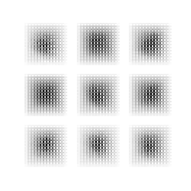
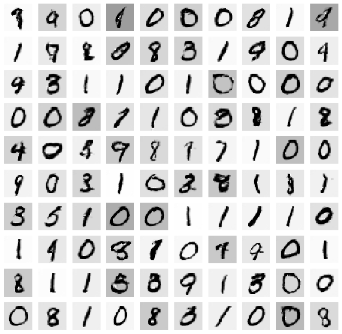

# Deep convolutional Generative Adversarial Networks (DCGANS)

Implementation of the popular paper UNSUPERVISED REPRESENTATION LEARNING WITH DEEP CONVOLUTIONAL GENERATIVE ADVERSARIAL NETWORKS
by Radford et.al. in Tensorflow

## What is a Generative Adversarial Network ?


Generative Adversarial Network or GAN (Refer to the paper **Generative Adversarial Networks** by Goodfellow et.al.) is a recently introduced Generative modeling framework that has two main components- a **Discriminator** and a **Generator**- both of which are primarily modeled using Neural Networks. The concept of GANS is simple yet effective - The **Generator** takes the noise as input and generates some data samples while the **Discriminator** tries to classify those samples from the real samples. This causes a two player game between the **Generator** and the **Discriminator** where the **Generator** tries to generate samples that are indistinguishable from the real data samples while the **Discriminator** becomes better at distinguishing between the samples generated by the **Generator**. The process continues till none of the Discriminator or the Generator can get any better, thus reaching an equilibrium (also called as the **Nash Equilibrium**).

## Why DCGANS


In practice GAN's are very hard to train mainly because of the following reasons : 

1) The Nash Equilibrium is very hard to reach using Gradient Descent based methods used for training
2) GAN's tend to collapse to a single mode during training thus generating a single sample in majority.
3) GAN training is unstable and requires a lot of model exploration and careful selection of hyperparameters.

**DCGANS** try to solve some of the above problems by using ConvNets in the Generator and Discriminator instead of simple MLP's. The authors in the paper also propose some architectual contraints on the ConvNets that helps stabilize GAN training. Some of these constraints are:

1) Using only convolutional layers in the Generator and the Discriminator by increasing the stride, therfore discouraging the use of MaxPooling and Dense layers in the ConvNet architecture

2) Using BatchNormalization in both the Generator and the Discriminator during training. However, during training I observed that using BatchNorm in all the layers causes the training to oscillate and destabilize.

3) The generator uses **tanh** activation in the final layer while the discriminator uses **leaky-relu** activation in all the layers.


# Diving into the code

## Prerequisites

The following python packages must be installed for running the code

- Python 2.7 or Python 3.3+
- Tensorflow 0.12.1
- Numpy
- Matplotlib
- ImageIO
- Scikit-learn

I prefer to use Google Collaboratory for training such systems due to heavy computational requirements. Here is the link to an excellent Medium Post for setting up Google Colab with Drive to manage your ML Projects: https://medium.com/deep-learning-turkey/google-colab-free-gpu-tutorial-e113627b9f5d

## Running the code

You can find the code for the DCGAN in the jupyter notebook ```DCGAN.ipynb```. Running it should be fairly simple as the code is well-commented and explained fairly well
On running the code you should expect to see the following directory structure in your current working directory

|--model_data_dcgan<br/>
&nbsp; &nbsp; &nbsp;|--experiment_<id></br>
&nbsp; &nbsp; &nbsp; &nbsp; &nbsp;|--tmp/</br>
&nbsp; &nbsp; &nbsp; &nbsp; &nbsp;|--checkpoints/</br>
&nbsp; &nbsp; &nbsp; &nbsp; &nbsp;|--gifs/</br>
&nbsp; &nbsp; &nbsp; &nbsp; &nbsp;|--config.yaml</br>

The ```tmp/``` folder contains the image generated by the **Generator** at every 100th training step given a fixed noise vector (refer to the code for this part)

The ```checkpoints/``` folder basically checkpoints your training (:P) so that you can resume if in case the training ends abruptly.

The gifs folder combines the images in ```tmp/``` folder to create a visualization over time representing the generator image generation over the duration of training

The file ```config.yaml``` stores the configuration of the Generator and the Discriminator neural networks for that particular experiment

## Results

### Model Architecture
Refer to DCGAN.ipynb for model architecture used for this experiment.

### Visualization
Following is the visualization for the samples generated by the Network Generator for a fixed noise vector input from the starting of the training over 5000 steps of training



Some samples generated by the Generator after the end of training are as follows:


## Conclusions

1) DCGAN performs better than the Vanilla GAN hands down !!. This may be due to the superior architecture of ConvNets over simple MLP's. The training for DCGAN's is much stable than for Vanilla GAN's
2) The architectural constraints as stated in the paper do help in stablizing the training of DCGAN's. However careful hyperparameter selection is still needed.
3) Using more number of filters in the convolutional layer--basically using a large CNN--with increased strides in the higher layers gives better perfomance than using MaxPooling layers in the Convolutional layers
4) Using **Dropout** in the Discriminator helps in training (though this is not mentioned in the architecture proposed in the training)
5) It is best to sample ```z``` from a Normal Distribution rather than a Uniform Distribution.

## Further Reading

Some good resources for knowing more about GAN's are :

1) The repo https://github.com/soumith/ganhacks provides a number of hacks to train GAN's in a stable setting.
2) The paper **Improved Techniques for Training GANS** by Tim Salimans et.al is an excellent resource for knowing more about GAN training. The paper can be found at https://arxiv.org/pdf/1511.06434.pdf
3) Interesting read about Transposed Convolution: https://towardsdatascience.com/up-sampling-with-transposed-convolution-9ae4f2df52d0 

## Author

Kushagra Pandey / @kpandey008
